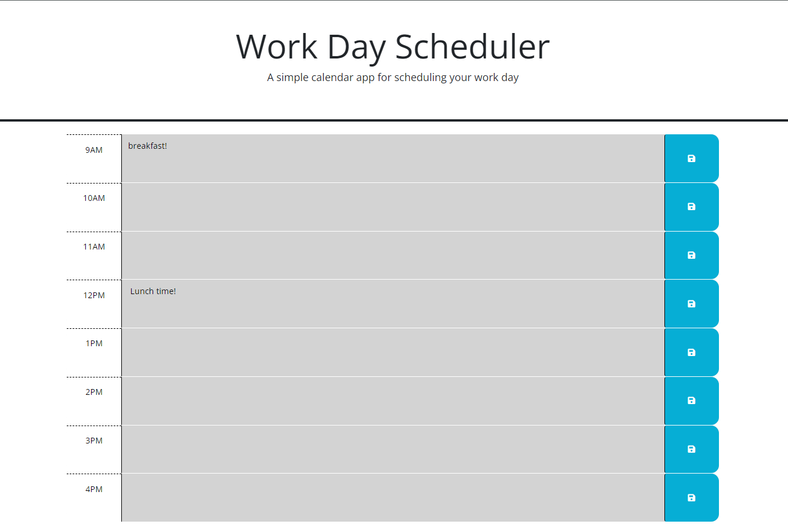

# orderTime

## Description

This weeks challenge was to create a simple work day scheduler. It tracks the real time and changes the hours color depending on if it is a future, past or present event. It saves the events into local storage and keeps them displayed for the user after refreshing the browser.


## User Story

```md
AS AN employee with a busy schedule
I WANT to add important events to a daily planner
SO THAT I can manage my time effectively
```

## Acceptance Criteria

```md
GIVEN I am using a daily planner to create a schedule
WHEN I open the planner
THEN the current day is displayed at the top of the calendar
WHEN I scroll down
THEN I am presented with timeblocks for standard business hours
WHEN I view the timeblocks for that day
THEN each timeblock is color coded to indicate whether it is in the past, present, or future
WHEN I click into a timeblock
THEN I can enter an event
WHEN I click the save button for that timeblock
THEN the text for that event is saved in local storage
WHEN I refresh the page
THEN the saved events persist
```


## Screenshots




## Link to deployed site


## License

No Licenses were used